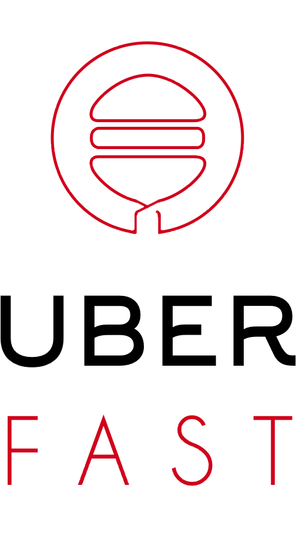

# Uber-Project
The repository contains the project did for the Design Digital Business Innovation Lab at @Polimi

## The Team

The team was composed by Joan Ficapal Vila, Riccardo Lo Bianco, Filippo Pedrazzini and Nicolò Vendramin.

## Description

The objective of the course was to analyze the Uber company and try to find new ways to improve their business.

## The Idea

We had an idea in the UberEATS context and we developed it in order to understand its value.

### UberFast

